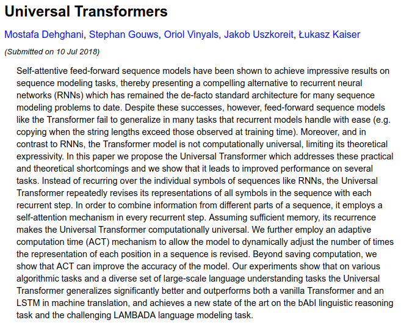

# Universal Transformers

Despite these successes, however, feed-forward sequence models like the Transformer fail to generalize in many tasks that recurrent models handle with ease \(e.g. copying when the string lengths exceed those observed at training time\). Moreover, and in contrast to RNNs, the Transformer model is not computationally universal, limiting its theoretical expressivity. In this paper we propose the Universal Transformer which addresses these practical and theoretical shortcomings and we show that it leads to improved performance on several tasks.

1. Instead of recurring over the individual symb ols of sequences like RNNs, the Universal Transformer repeatedly revises its representations of all symbols in the sequence with each recurrent step.
2. In order to combine information from different parts of a sequence, it employs a **self-attention** mechanism in every recurrent step.
3. Assuming sufficient memory, its recurrence makes the Universal Transformer computationally universal. 
4. We further employ an adaptive computation time \(ACT\) mechanism to allow the model to **dynamically adjust** the number of times the representation of each position in a sequence is revised. 
   1. Beyond saving computation, we show that ACT can improve the accuracy of the model. 

Our experiments show that on **various algorithmic tasks** and a diverse set of large-scale **language understanding** tasks the Universal Transformer generalizes significantly better and outperforms both a vanilla Transformer and an LSTM in machine translation, and achieves a new state of the art on the bAbI linguistic reasoning task and the challenging LAMBADA language modeling task.

